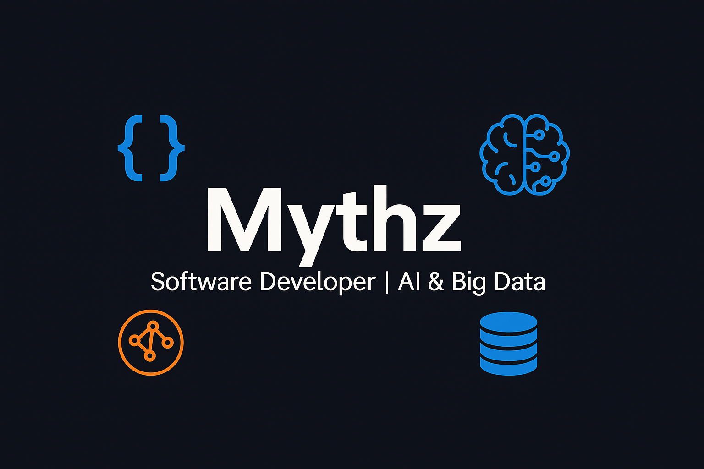

# 👋 ¡Hola! Soy Mythz

🚀 **Software Developer | Freelance Fullstack**

🎓 **Máster en Inteligencia Artificial y Big Data**

💡 Apasionado por el desarrollo de software, la IA y los retos tecnológicos.

  

---

## 🧑‍💻 Sobre mí

- 🎓 Máster en IA y Big Data.
- 🌱 Siempre aprendiendo y perfeccionando mis habilidades en desarrollo de software, inteligencia artificial, big data y soluciones cloud.
- 💻 Trabajo con: **Java, Python, C#, Kotlin, SQL, MySQL, MongoDB, Azure, .NET, .NET MAUI, Tableau, Docker, RabbitMQ, Node-RED, LM Studio, Ollama, Anything LM, RAG**.
- 🧩 Desarrollador con enfoque en arquitectura **MVVM** y principios **SOLID**.
- ⚡ Experiencia en **metodologías ágiles** para equipos de desarrollo colaborativos.
- 🤖 Interesado en LLMs, RAG, automatización y el ecosistema open source de IA.
- 🧠 Disfruto resolviendo problemas y aprendiendo tecnologías nuevas cada día.

---

## 🛠️ Tecnologías y herramientas

---

## 📫 Contacto

- ✉️
- 🌐

---

## 📊 GitHub Stats

---

¡Gracias por visitar mi perfil! 🚀
